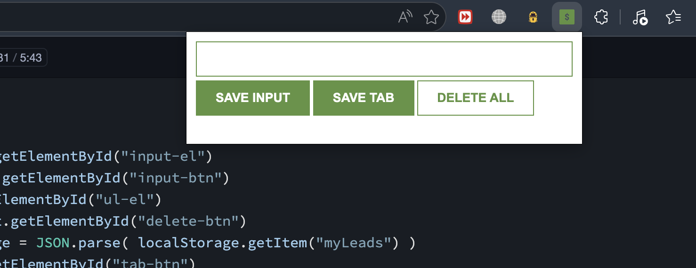
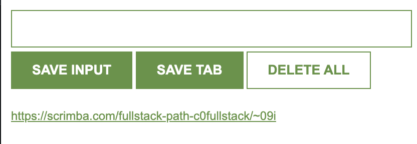

# 📌 Lead Tracker Chrome Extension

A lightweight and user-friendly Chrome Extension built with **HTML**, **CSS**, and **JavaScript** that helps users save website URLs and custom notes for future reference. The extension uses **Local Storage** to persist data even after the browser is closed.

## 🚀 Features

- 🔖 Save the current browser tab URL with one click
- 📝 Save custom text or links entered manually
- 💾 Stores data using Local Storage
- 🔄 Data persists after browser restart
- 🗑️ Delete all saved leads with a single click
- ⚡ Fast and lightweight
- 🎯 Simple and intuitive interface

---

## 📸 Preview

### Extension Interface



### Saving Current Tab



---

## 🛠️ Built With

- HTML5
- CSS3
- JavaScript (ES6)
- Chrome Extension Manifest V3
- Local Storage API
- Chrome Tabs API

---

## 📂 Project Structure

```text
Chrome-Extension/
│
├── index.html
├── index.css
├── index.js
├── manifest.json
├── icon.png
├── package.json
├── vite.config.js
├── preview1.png
├── preview2.png
└── README.md
```

---

## ⚙️ Installation

### Clone the repository

```bash
git clone https://github.com/BinaryBlaze16/Chrome-Extension.git
```

### Open Chrome Extensions

Go to

```
chrome://extensions
```

Enable

```
Developer Mode
```

Click

```
Load unpacked
```

Select the project folder.

The extension is now ready to use.

---

## 📖 How to Use

### Save Custom Input

1. Enter a URL or note into the input field.
2. Click **Save Input**.
3. The data will be saved locally.

### Save Current Browser Tab

1. Open the webpage you want to save.
2. Click the extension icon.
3. Press **Save Tab**.
4. The current tab URL will be stored automatically.

### Delete All Saved Leads

Double-click **Delete All** to remove every saved item from Local Storage.

---

## 🧠 Technologies Used

- JavaScript DOM Manipulation
- Event Listeners
- Local Storage
- Chrome Tabs API
- Arrays & Objects
- Manifest V3

---

## 🎯 Future Improvements

- ✏️ Edit saved leads
- ⭐ Favorite important links
- 🔍 Search saved links
- 🗂️ Categories and tags
- ☁️ Cloud sync
- 🌙 Dark Mode
- 📤 Export & Import saved data
- 🔗 Open links in new tabs
- 📅 Add timestamps

---

## 📚 What I Learned

This project helped me improve my understanding of:

- Chrome Extension Development
- Manifest V3
- Local Storage API
- Chrome Tabs API
- JavaScript Event Handling
- DOM Manipulation
- Data Persistence
- Browser APIs

---

## 👨‍💻 Author

**Anant Srivastava**

GitHub: https://github.com/BinaryBlaze16

---

## 🤝 Contributing

Contributions are welcome!

If you have ideas for improvements, feel free to fork the repository and submit a pull request.

---

## ⭐ Show Your Support

If you like this project, consider giving it a ⭐ on GitHub.

It motivates me to build more useful projects.

---

## 📄 License

This project is licensed under the **MIT License**.